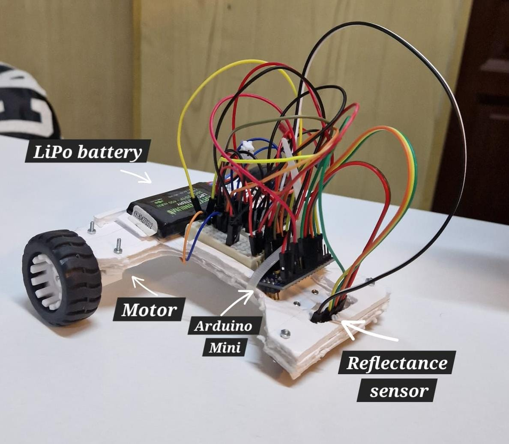
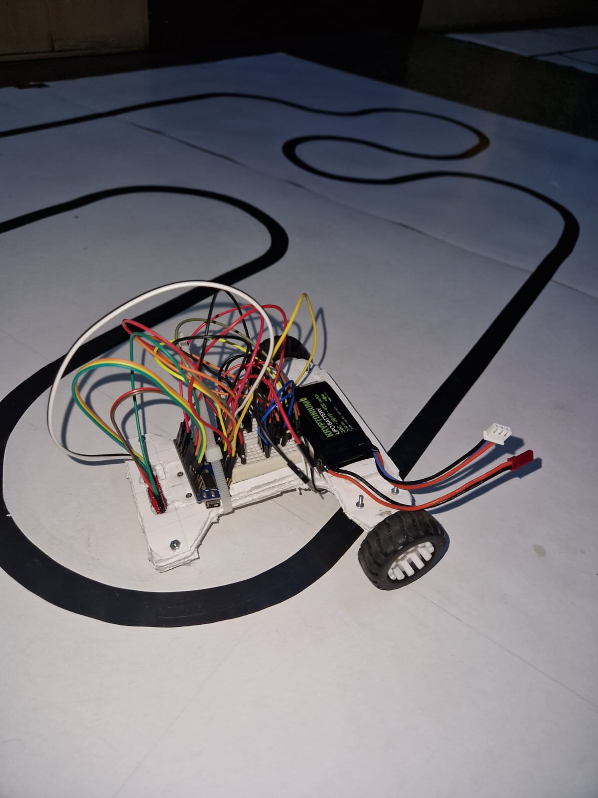

# LineFollower 🚘 - Formula-E 🚘

This is was a team project created during the Robotics class at my university. The purpose was to organize a competition between students, who had the aim of developing the fastest car to finish the circuit. My teammates are also the collaborators of this repository. Check their Github too!👀 

## Components used : 

 - QTR-8A reflectance sensor
 - L293D motor driver 
 - DC motors (2) ⚙️
 - Power source ( LiPo battery ) 🔋
 - Arduino Pro Mini
 - Zip-ties
 - Wheels (2) 
 - Ball caster
 - Chassis
 - Small Breadboard

## The brains behind 🧠
The system control was created with the help of PID ( Proportional Integral Derivative) tuning. Through trial and error approach combined with theoretical foundations we were able to find the best parameters to suit our designed car model. Our car also does autocalibration at the beginning, facilitating an accurate reading of values.

## Final results 🏅
 - Final time : 16.5 seconds ⌚️

## Picture of the setup 🛠

## Rally video 🏁
 - Final lap :  https://youtu.be/FC_47IJ0Sd4?si=RVNvG5954KcFUV00
 - Precision and speed : https://youtube.com/shorts/kN8j0FzfTgg?si=-uUWvrgluMTXll27